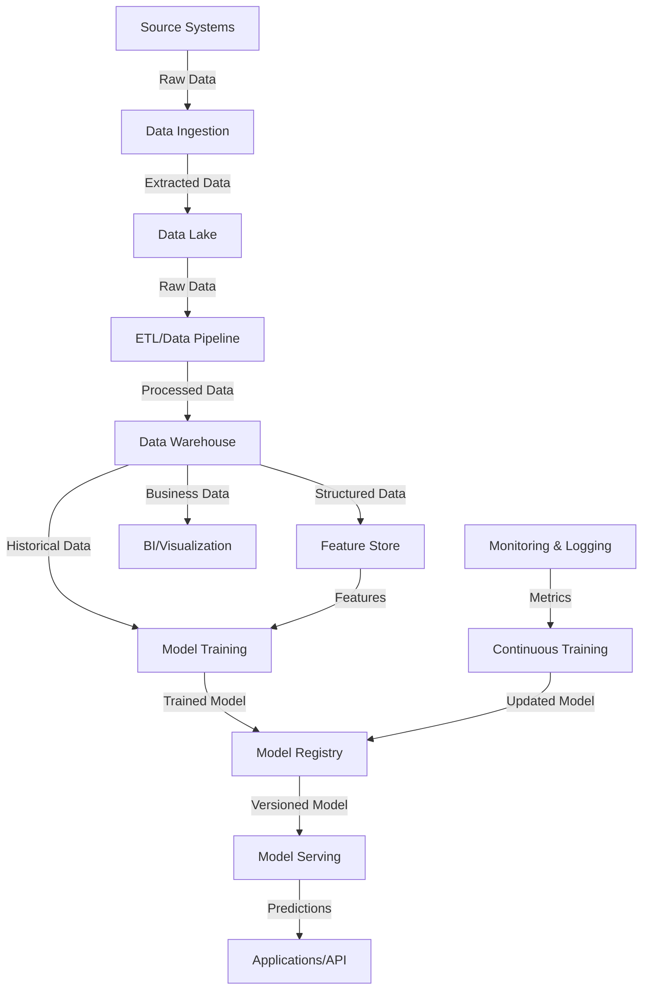

```mermaid
graph TD
    A[Source Systems] -->|Raw Data| B[Data Ingestion]
    B -->|Extracted Data| C[Data Lake]
    C -->|Raw Data| D[ETL/Data Pipeline]
    D -->|Processed Data| E[Data Warehouse]
    E -->|Structured Data| F[Feature Store]
    E -->|Historical Data| G[Model Training]
    F -->|Features| G
    G -->|Trained Model| H[Model Registry]
    H -->|Versioned Model| I[Model Serving]
    I -->|Predictions| J[Applications/API]
    E -->|Business Data| K[BI/Visualization]
    L[Monitoring & Logging] -->|Metrics| M[Continuous Training]
    M -->|Updated Model| H
```